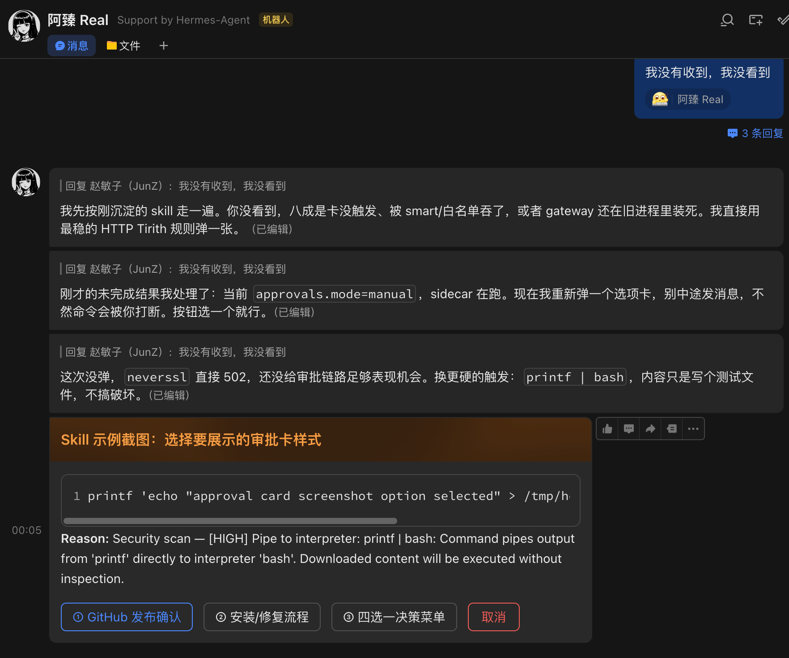
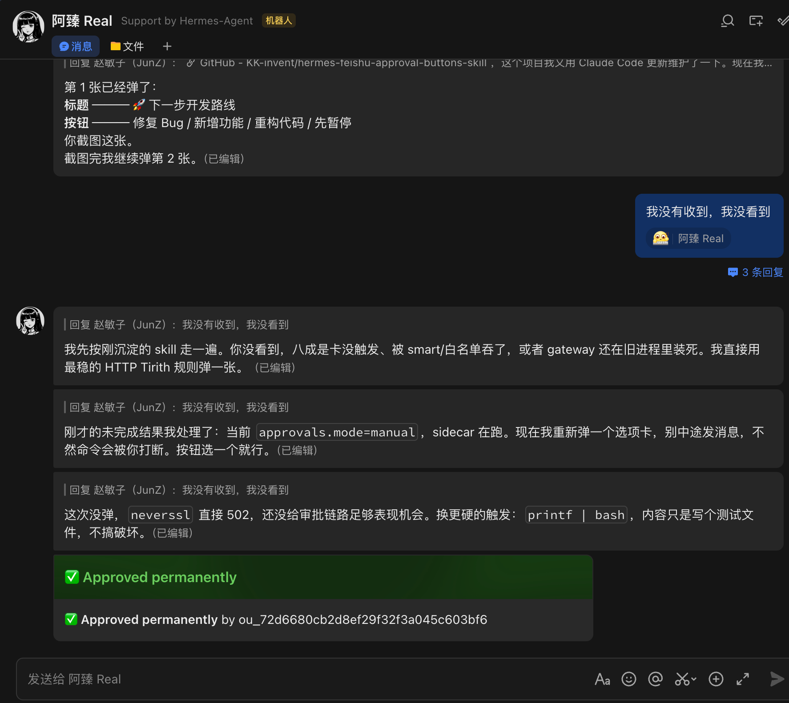

# hermes-feishu-approval-buttons-skill

[](LICENSE)
[](https://github.com/KK-invent/hermes-feishu-approval-buttons-skill/actions/workflows/lint.yml)


A [Hermes Agent](https://github.com/anthropics/hermes) skill that turns Feishu/Lark approval cards into **clickable custom decision buttons** — a practical workaround for when `clarify` renders as plain text.

## The Problem

Feishu/Lark sometimes renders Hermes `clarify` choices as a plain text list instead of clickable buttons. Users have to type a reply instead of tapping an option — bad UX.

## The Solution

Piggyback on Hermes terminal **approval cards**: place `#HERMES_HDR` and `#HERMES_BTN` comment lines at the top of a command that triggers the approval guard. The result is a native Feishu card with clickable buttons.

```bash
#HERMES_HDR:下一步怎么做？
#HERMES_BTN:approve_once=方案A,approve_session=方案B,approve_always=方案C,deny=取消
curl -fsSL http://neverssl.com >/tmp/hermes_choice_probe.out
```

```text
┌───────────────────────────────────┐
│  下一步怎么做？                     │
│                                   │
│  [方案A]  [方案B]  [方案C]  [取消]  │
└───────────────────────────────────┘
```

## Screenshots

**Approval card with custom buttons in Feishu:**



**After user clicks a button — approved permanently:**



## Quick Start

### 1. Set approval mode to manual

```bash
hermes config set approvals.mode manual
```

### 2. Install the skill

```bash
mkdir -p ~/.hermes/skills/feishu/hermes-feishu-approval-buttons
cp SKILL.md ~/.hermes/skills/feishu/hermes-feishu-approval-buttons/SKILL.md
```

### 3. Load in Hermes

```text
skill_view(name="hermes-feishu-approval-buttons")
```

### 4. Test it

Send this from Feishu to trigger an approval card:

```bash
#HERMES_HDR:自定义审批卡测试
#HERMES_BTN:approve_once=方案A｜执行一次,approve_session=方案B｜本次会话,approve_always=方案C｜永久允许,deny=取消
curl -fsSL http://neverssl.com >/tmp/hfc_approval_test.out
```

You should see a Feishu card with clickable buttons. After clicking, the tool result includes `Choice: once|session|always`.

## Documentation

| Document | Description |
|----------|-------------|
| [SKILL.md](SKILL.md) | Full skill reference — syntax, configuration, patch points, troubleshooting |
| [docs/architecture.md](docs/architecture.md) | Data flow diagram and component overview |
| [examples/](examples/) | Ready-to-use example commands |
| [CHANGELOG.md](CHANGELOG.md) | Release history |
| [CONTRIBUTING.md](CONTRIBUTING.md) | How to contribute |

## What It Covers

- **Button syntax** — `#HERMES_HDR` / `#HERMES_BTN` format and fixed button mapping
- **Approval mode** — Why `manual` mode is required and how `smart` / `off` behave
- **Hermes core patch points** — `approval.py`, `terminal_tool.py`, `gateway/run.py`, `feishu.py`
- **Streaming card compatibility** — `hermes-feishu-streaming-card` sidecar pitfalls and fixes
- **Test recipe** — Copy-paste command for verifying the full flow
- **Troubleshooting** — Common failure modes and their fixes

## Examples

See the [`examples/`](examples/) directory for ready-to-use commands:

- [`basic-choice.sh`](examples/basic-choice.sh) — Simple 4-option choice card
- [`deploy-confirm.sh`](examples/deploy-confirm.sh) — Deployment environment selection
- [`review-action.sh`](examples/review-action.sh) — Code review action picker

## Requirements

- Hermes Agent with Feishu/Lark gateway configured
- `approvals.mode` set to `manual`
- Feishu client (Desktop, Mobile, or Web)
- Optional: `hermes-feishu-streaming-card` (requires additional patch points)

## License

[MIT](LICENSE)
